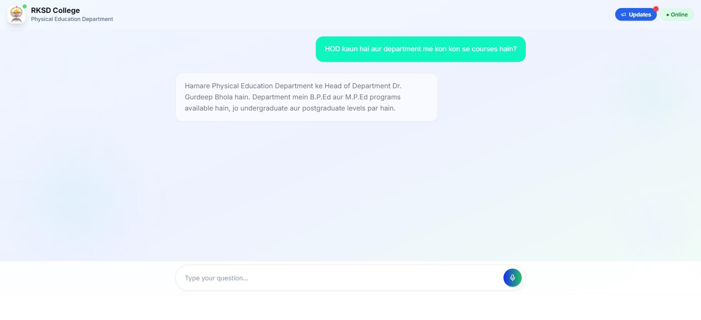
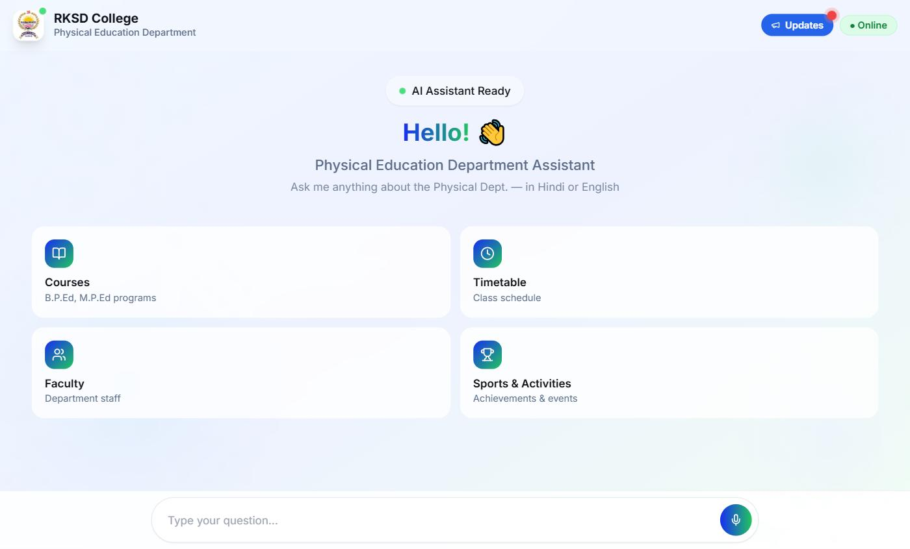
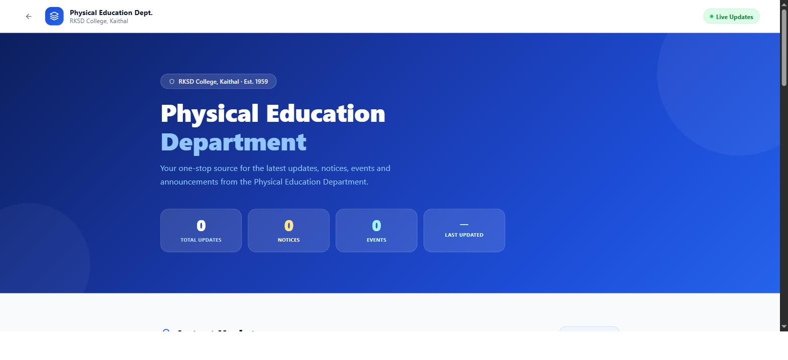
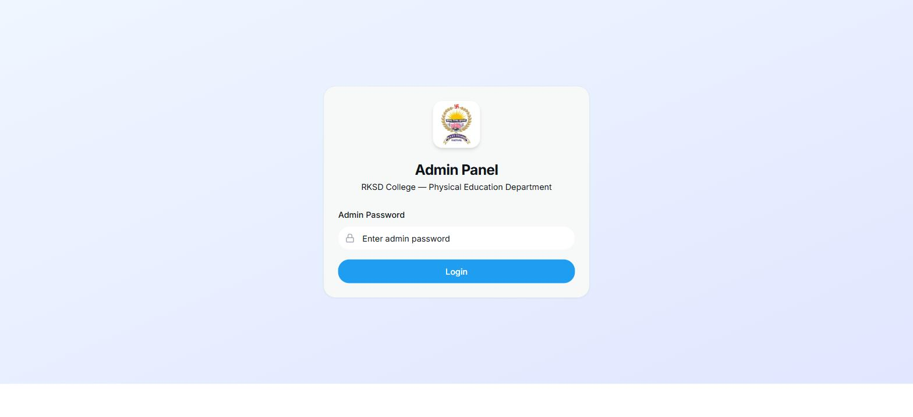

<h1 align="center">RKSD College — AI Assistant & Admin Platform</h1>

<p align="center">
  A voice-and-text AI assistant that answers real student questions about a real college —<br>
  backed by a full admin platform where staff keep the answers accurate.
</p>

<p align="center">
  <a href="https://rksd-department-sport-assistant.onrender.com"><b>🔗 Live Demo</b></a> ·
  <a href="#-features"><b>Features</b></a> ·
  <a href="#-how-the-ai-works"><b>How the AI works</b></a> ·
  <a href="#-getting-started"><b>Getting started</b></a>
</p>

<p align="center">
  
  
  
  
  
  
  
</p>

<p align="center">
  
</p>

---

## What this is

Students ask their college the same questions every year — *what's the fee, who's the HOD, when is the practical, what's in semester 3, is there a notice today.* The answers exist, but they're scattered across notice boards, WhatsApp groups and PDFs nobody can find.

This project puts one assistant in front of all of it.

Students talk to it — by voice or text, in **English, Hindi or Hinglish**, typos included. Behind it, the department's staff maintain the actual data through role-based admin panels, so the assistant is never guessing: it answers from the college's own database, and only falls back to a live Google search when the database genuinely has nothing.

Built for the **Physical Education Department at RKSD College**, and running in production.

> **Live:** https://rksd-department-sport-assistant.onrender.com
> *(free Render tier — the first request after idle can take ~30s to wake the server)*

---

## 📸 Screens

<table>
  <tr>
    <td width="50%"></td>
    <td width="50%"></td>
  </tr>
  <tr>
    <td align="center"><b>Assistant</b> — quick topics, voice or text input</td>
    <td align="center"><b>Updates board</b> — public notices at <code>/updates</code></td>
  </tr>
  <tr>
    <td></td>
    <td></td>
  </tr>
  <tr>
    <td align="center"><b>Hinglish Q&A</b> — answered from the college database</td>
    <td align="center"><b>Admin panel</b> — password-gated staff access</td>
  </tr>
</table>

---

## ✨ Features

### For students
- **Voice + text chat** — speak or type, get a spoken answer back
- **Hinglish & typo tolerant** — *"tumhari uplabdhiyan btao"* and *"achivments"* both work
- **Conversation memory** — follow-up questions keep their context, and survive a page refresh
- **Answers grounded in real data** — staff, courses, fees, syllabus, timetable, notices, achievements
- **Google fallback** — for genuine general questions the college database can't answer
- **Public updates board** (`/updates`) — notices and announcements with file attachments
- **Email subscriptions** — get new department updates in your inbox

### For the college
- **Main Admin Panel** — staff, courses, class schedules, facilities, admissions, and 18 categories of general college information
- **Head Admin Panel** — departments, notices, achievements, image uploads, subscriber management, credential resets
- **Teacher Mini Panel** — per-department JWT-authenticated panel so each teacher manages only their own department's data
- **Syllabus Manager** — 24 courses across 6 semesters with ~184 unit/topic rows
- **AI-assisted data entry** — paste messy text or upload a file, and the AI structures it into staff/course/event records for review before saving
- **HOD protection** — the department head record is pinned, edit-only, and delete-blocked at both the UI and server layers

### Under the hood
- **183 REST endpoints** across seven route modules
- **~20,000 lines** of application TypeScript
- **Multi-key API rotation** — up to 20 Groq keys, auto-rotating on quota exhaustion
- **Token-overflow protection** — context is fetched selectively and hard-capped

---

## 🧠 How the AI works

The naive version of this app stuffs the entire college database into every prompt and hopes the model sorts it out. That breaks on cost, latency and token limits by about the third table.

Instead, every question goes through a **fetch-planning step first**:

```
User question
     │
     ▼
┌─────────────────────────────────────────────┐
│ 1. Intent analysis                          │
│    Groq llama-3.1-8b-instant                │
│    → { fetchStaff: true, fetchCourses: false, … }
│    (regex keyword fallback if Groq is down) │
└─────────────────────────────────────────────┘
     │
     ▼
┌─────────────────────────────────────────────┐
│ 2. Selective fetch from Supabase            │
│    Only the tables the plan asked for       │
│    Row caps per table · 12,000-char ceiling │
└─────────────────────────────────────────────┘
     │
     ▼
┌─────────────────────────────────────────────┐
│ 3. Answer generation                        │
│    OpenAI GPT-4o                            │
│      ↓ on failure                           │
│    Groq multi-key rotation (20 keys)        │
└─────────────────────────────────────────────┘
     │
     ▼
┌─────────────────────────────────────────────┐
│ 4. Google fallback (SerpAPI)                │
│    Only if the answer is "I don't know"     │
│    AND the question isn't off-topic         │
└─────────────────────────────────────────────┘
     │
     ▼
  Text + speech response
```

**What each stage buys you**

| Stage | Why it exists |
|---|---|
| Intent analysis | A greeting shouldn't trigger nine database queries. Cuts cost and latency on the common case. |
| Selective fetch | Keeps prompts small enough to stay well inside the context window even as the database grows. |
| Provider fallback | GPT-4o for quality, Groq for resilience — a single provider outage doesn't take the assistant down. |
| Key rotation | Free-tier Groq keys hit quota fast. Twenty rotating keys turn that from an outage into a non-event. |
| Google fallback | Honest coverage: the assistant admits when the college data has nothing, then goes and looks. |

**Session memory** is two-layered: an in-memory `SessionManager` on the server (2-hour TTL), plus the client sending its last 10 messages with every request. When the free-tier server sleeps and restarts, the conversation is rebuilt from the client's history instead of dropping the user mid-thread.

---

## 🛠 Tech stack

| Layer | Stack |
|---|---|
| **Frontend** | React 18, Vite, TypeScript, Wouter, TanStack Query |
| **UI** | TailwindCSS, shadcn/ui (Radix), Framer Motion, GSAP, Three.js / React Three Fiber |
| **Backend** | Node.js, Express, TypeScript, Zod |
| **Database** | Supabase (PostgreSQL), Drizzle ORM |
| **AI** | Groq (llama-3.1-8b-instant), OpenAI GPT-4o, SerpAPI |
| **Voice** | Web Speech API (input), server-side TTS with Hindi/English detection |
| **Auth** | JWT, bcrypt |
| **Email** | Nodemailer (Gmail SMTP) |
| **Deploy** | Render, GitHub Actions keep-alive |

---

## 📁 Project structure

```
├── client/src/
│   ├── pages/              # home (chat), admin panels, mini-panel, updates board
│   └── components/
│       ├── admin/          # staff, courses, syllabus, events, facilities sections
│       ├── head-admin/     # department + notice management
│       └── ui/             # shadcn/ui primitives
├── server/
│   ├── routes.ts           # chat API, context assembly, system prompt
│   ├── query-analyzer.ts   # AI intent analysis + keyword fallback
│   ├── groq-multi-key.ts   # 20-key rotation with quota failover
│   ├── session-manager.ts  # in-memory sessions, 2h TTL
│   ├── routes-admin.ts     # staff / courses / syllabus CRUD
│   ├── routes-head-admin.ts# departments, notices, achievements, uploads
│   ├── routes-department.ts# teacher mini-panel APIs (JWT)
│   ├── routes-updates.ts   # updates board + email subscriptions
│   └── email-service.ts    # Gmail SMTP
├── shared/schema.ts        # shared types
├── setup.sql               # core tables
└── syllabus-setup.sql      # syllabus tables + 24 courses
```

---

## 🚀 Getting started

**Prerequisites:** Node.js 20+, a [Supabase](https://supabase.com) project, and a free [Groq](https://console.groq.com) API key.

```bash
git clone https://github.com/icexchange22-prog/rksd-college-ai-assistant.git
cd rksd-college-ai-assistant
npm install --legacy-peer-deps
cp .env.example .env      # then fill it in
npm run dev               # http://localhost:5000
```

**Database setup** — in the Supabase SQL Editor, run:
1. `setup.sql` — core tables
2. `syllabus-setup.sql` — syllabus tables and course data

Then create a public storage bucket named `updates-files` for update attachments.

**Environment** — see [`.env.example`](.env.example) for the full list. The minimum to boot: `SUPABASE_URL`, `SUPABASE_SERVICE_ROLE_KEY`, `SUPABASE_ANON_KEY`, `GROQ_API_KEY_1`, `JWT_SECRET`.

Everything else degrades gracefully — no `OPENAI_API_KEY` falls back to Groq, no `SERPAPI_KEY` disables the Google fallback, no email vars disable subscriptions.

### Scripts

| Command | Does |
|---|---|
| `npm run dev` | Dev server with hot reload |
| `npm run build` | Vite client build + esbuild server bundle |
| `npm start` | Production server |
| `npm run check` | TypeScript type check |

---

## 📦 Deployment

Deployed on Render:

- **Build:** `npm install --legacy-peer-deps && npm run build`
- **Start:** `npm start`
- **Node:** pinned to `20.11.0` via `.node-version`
- **Keep-alive:** a GitHub Actions workflow pings `/api/health` so the free instance doesn't sleep

---

## 🗺 Routes

| Route | What it is |
|---|---|
| `/` | Student AI assistant (voice + chat) |
| `/updates` | Public updates and notices board |
| `/notice-board` | Official notices |
| `/admin` | Main admin panel |
| `/head-admin` | Head admin panel |
| `/mini-panel` | Teacher department panel |
| `/department/:slug` | Public department page |
| `/api/health` | Health check |

---

## 📄 License

MIT — see [LICENSE](LICENSE).

---

<p align="center">
  Built by <a href="https://github.com/icexchange22-prog"><b>Ajay</b></a> · Haryana, India 🇮🇳
</p>
